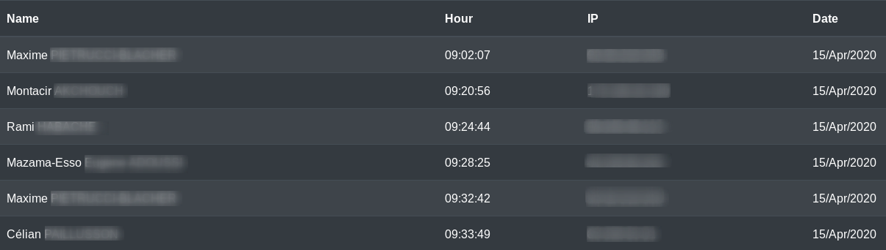

## This script will clean up and parse your logs by users connection time and IP address.

Syntax example:

#. /log_parser  my-log-file  my-output-file

Don't give your output file a extension the script will do it for you.

# Log file example   

# Html export look like

